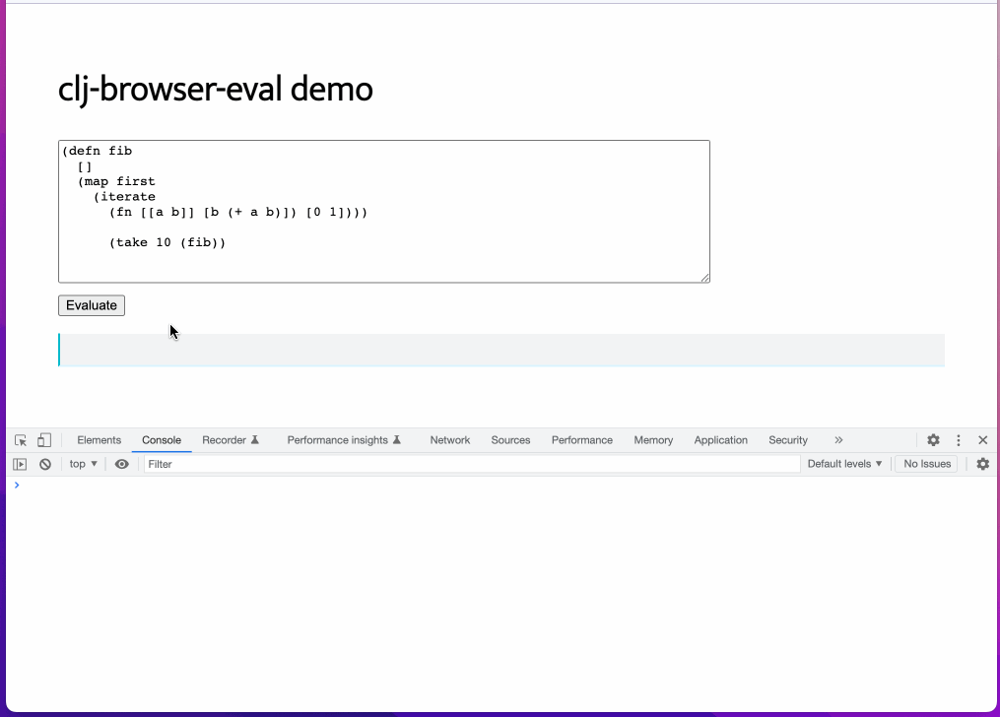

# clj-browser-eval

This is a thing that lets you turn any HTML input field into a Clojure interpreter.



CodePen: [https://codepen.io/nichelodean/pen/zYWEgeW](https://codepen.io/nichelodean/pen/zYWEgeW)

## quick start

In your html:
```html
<script src="https://cdn.jsdelivr.net/npm/clj-browser-eval@0.0.4/dist/index.js"></script>

<div clj-interpreter>
  <textarea clj-code type="textarea" rows="9" cols="80">
(defn fib
  []
  (map first
    (iterate
      (fn [[a b]] [b (+ a b)]) [0 1])))

(take 10 (fib))</textarea>
  <div>
    <button clj-eval>Evaluate</button>
  </div>
  <pre clj-result></pre>
</div>
```

`clj-interpreter` marks the container div for an interpreter

`clj-code` marks the text input that you want to use as the input for the interpreter

`clj-eval` designates the button (or any clickable thing) that you want to use to trigger evaluation

`clj-result` (optional - results will be window.alert'ed if this is not provided) designates where the result should go

### installing with npm

```bash
npm install clj-browser-eval
```

## some considerations

I have no idea what I'm doing and you should not use this for anything real.

## credits

Made possible by [scittle](https://github.com/babashka/scittle)!
